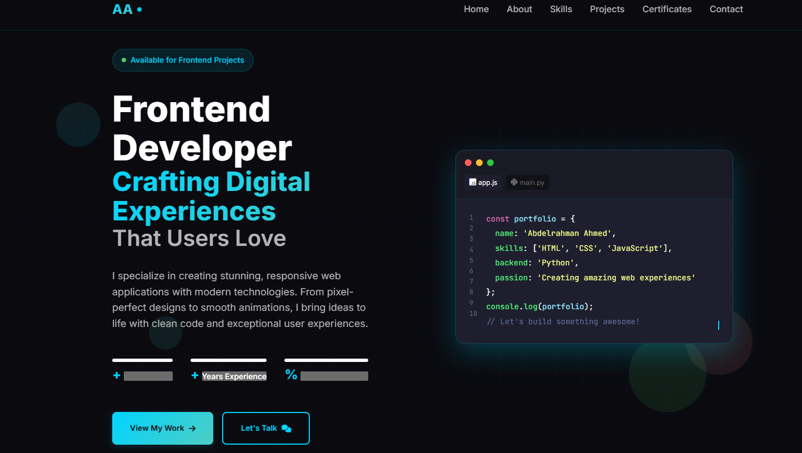

# 🌐 Personal Portfolio Website

## 📌 Overview

This is my personal portfolio website, designed and developed to showcase my skills, projects, and experience as a front-end developer.
The website is built as a **single-page application** and represents my journey in programming.

---

## 🚀 Features

* Fully responsive design (Desktop, Tablet, Mobile)
* Clean and modern UI
* Smooth animations and transitions
* Interactive navigation menu (scroll between sections)
* Contact form with validation
* Back-to-top button for better user experience

---

## 🛠️ Technologies Used

* HTML5
* CSS3
* JavaScript (Vanilla JS)

---

## 🎨 Styling Approach

* Custom CSS (No frameworks used)
* Built completely from scratch without Bootstrap or Tailwind

---

## 🎨 Design

The website was designed with a focus on:

* Simplicity and readability
* Smooth scrolling between sections
* Consistent color palette
* Responsive layout for all devices

---

## 📂 Project Structure

```id="c3n9ks"
/project-folder
│── index.html
│── /css
│── /js
│── /images
```

---

## 🔗 Live Demo

👉 [https://abdotete142-maker.github.io/-My-protofolio/](#)

---

## 📸 Screenshot

()

---

## ⚙️ Setup Instructions

1. Clone the repository:

```id="j0f1ls"
git clone https://github.com/your-username/your-repo.git
```

2. Open the project folder:

```id="v0c2xp"
cd your-repo
```

3. Open `index.html` in your browser

---

## 💡 What I Learned

* Building a complete responsive website from scratch
* Structuring a single-page layout effectively
* Writing clean and organized code
* Improving UI/UX design skills
* Using JavaScript for interactivity and animations

---

## 🔮 Future Improvements

* Convert to multi-page structure
* Add more projects
* Improve animations
* Connect contact form to backend

---

## 👤 Author

Developed by **Abdelrahman**

---

## ⭐ Support

If you like this project, feel free to give it a star ⭐ on GitHub!
